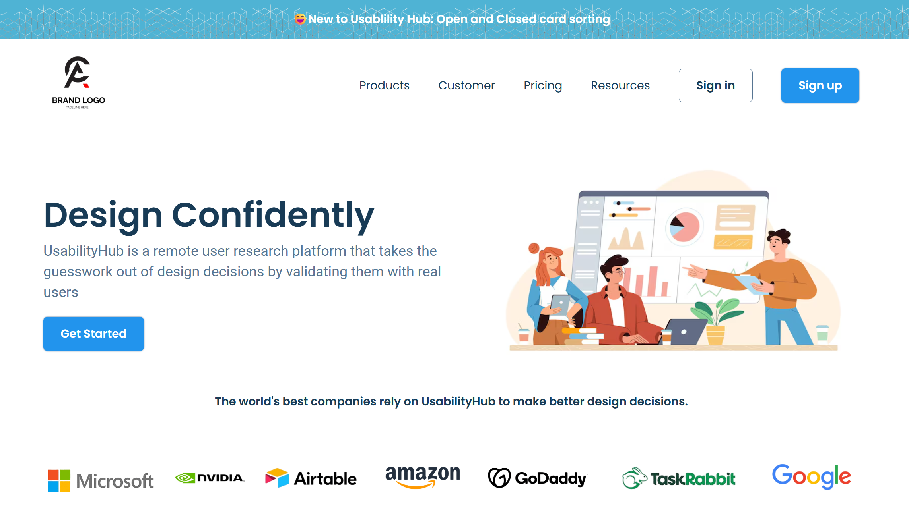

# 🌐 Company Website

A modern and responsive company website built using HTML and CSS.
This project focuses on creating a clean UI, structured layout, and responsive design suitable for real-world business websites.

---

## 🚀 Features

* ✨ Clean and professional UI design
* 📱 Fully responsive layout (mobile, tablet, desktop)
* 🧭 Well-structured sections (Home, About, Services, Contact)
* ⚡ Fast and lightweight (pure HTML & CSS)
* 🎯 Beginner-friendly and easy to customize

---

## 🛠️ Technologies Used

* HTML5
* CSS3

---

## 🌍 Live Demo

🔗 https://varun-kumar-reddy-p.github.io/Company_website/


---

## 📸 Preview

 

---

## 📂 Project Structure

```
Company_website/
│── index.html
│── style.css
│── media-queries.css
│── images/
```

---

## 🎯 Purpose

This project was created to:

* Practice frontend development skills
* Understand responsive web design
* Build real-world company website layouts

---

## 📌 Future Improvements

* Add JavaScript for interactivity
* Improve animations and transitions
* Add contact form functionality
* Optimize for SEO

---

## 👨‍💻 Author

**Varun Kumar Reddy**

* GitHub: https://github.com/Varun-Kumar-Reddy-P 
* LinkedIn: https://linkedin.com/in/varunkumarreddypothula/ 

---

## ⭐ Support

If you like this project, consider giving it a ⭐ on GitHub!
